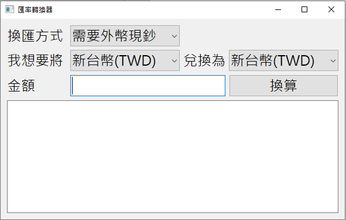
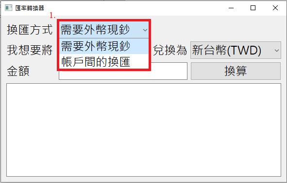
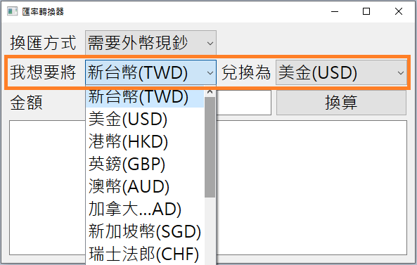
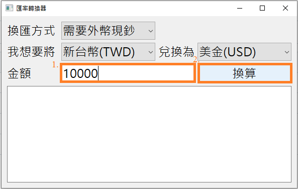
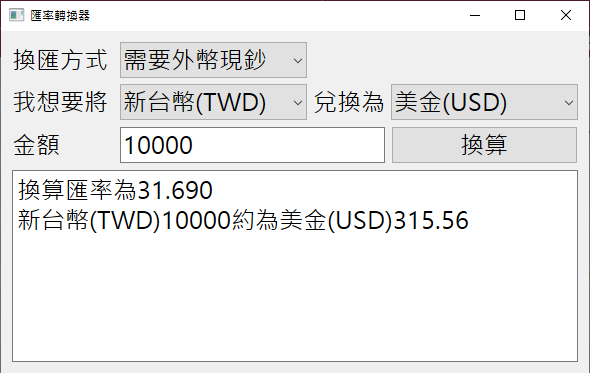

# 即時匯率轉換器

本專案是一款基於 **PyQt6** 的桌面應用程式，可自動從目標金融網站擷取匯率，並在使用者按下「換算」按鈕時即時重新抓取最新資料，確保換算結果永遠維持最新、最準確。

---
## 📘 專案背景與動機
近年全球通膨、供應鏈重組與地緣政治變動，使各國匯率波動加劇，提升了即時匯率資訊的重要性。
儘管現在搜尋匯率十分方便，然多數平台僅能提供單次查詢，缺乏適合跨境電商、投資者與工程師使用的自動化匯率監控與批次轉換功能。
本專案旨在開發一套可在匯率查詢網頁上自動擷取最新匯率或即時匯率，使用者只需輸入金額與幣別即可立即取得準確結果，並可支援多幣別快速換算的工具。

---
## 🎯 專案目的
本專案旨在利用 **PyQt6** 建立直覺、易操作的圖形化介面， 並透過 **requests** 與 **BeautifulSoup** 自動以臺灣銀行牌告匯率的url 為網頁內容取得對象最新匯率，結合**sys**管理程式執行與GUI主事件迴圈，實現一款可讓使用者在按下「換算」按鈕時即時重新抓取最新匯率的桌面應用程式。
整體目標為提供：
- 即時匯率查詢
- 快速貨幣換算
- 簡潔易用的桌面工具
  
---
## 🚀 技術亮點
### ✔️ **按一次換算就即時抓匯率**（重大更新）  
每次按下「換算」按鈕時 `requests + BeautifulSoup` 會重新對網站發送請求，確保資料永遠是最新的。
### ✔️ PyQt6 GUI  
- 下拉式選單選擇幣別  
- 即時顯示換算結果  
- 使用者體驗清爽、簡潔  
### ✔️ 自動 HTML 解析  
利用 `BeautifulSoup` 從牌告匯率表格擷取**現金匯率、即期匯率的買入和賣出**。
### ✔️ 清楚結構化的程式架構  
程式邏輯分離、可讀性高，方便後續擴充自動更新、定時輪詢等功能。

---

## 📘 專案說明

 ### 本匯率轉換器為一款以 **PyQt6** 開發的桌面匯率轉換器，具備以下操作流程：
1. 使用者可點開**換匯方式**的選單，依個人需求從**需要外幣現鈔**和**帳戶間的換匯**中選擇。

   
  
2. 使用者選擇欲轉換的**幣別**(兩選單中皆有20個幣別可供選擇)並輸入**金額**。

   
   
   
3. 按下 **「換算」** 按鈕後：
   - 程式會立即使用 `requests` 向臺灣銀行牌告匯率網站發送 HTTP 請求。
   - 以 `BeautifulSoup` 解析最新匯率表格，此時匯率換算器匯根據換匯方式的選擇抓取不同的匯率資料參與計算:

     a. 如若換匯方式選擇**需要外幣現鈔**，匯率換算器會抓取最新的買入和賣出之**現金匯率**資料計算換算結果。

     b. 如若換匯方式選擇**帳戶間的換匯**，匯率換算器會抓取最新的買入和賣出之**即期匯率**資料計算換算結果。

4. 換算結果將即時顯示在 PyQt6 的 GUI 介面中。

    
     

---
 ## 🔗成品下載
👉 Google Drive 成品下載連結：
 - https://drive.google.com/file/d/1-Ug_Oa836-9wsX2v3MP825SBw6-_vIXA/view?usp=drive_link

## 🛠️ 使用技術
- Python 3.13.5
- PyQt6
- BeautifulSoup4
- requests
- sys

---
## 📌 未來可擴充方向
- 每 N 秒自動更新匯率
- 多幣別批次換算
- 即時匯率趨勢圖(套用Matplotlib 整合)
- 自動偵測網路是否中斷
- 增加「更新匯率」按鈕

---
## 📄 授權
- MIT License
